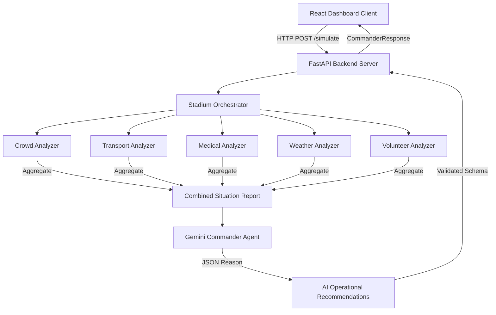

# Stadium Commander

[](https://react.dev/)
[](https://www.typescriptlang.org/)
[](https://fastapi.tiangolo.com/)
[](https://www.python.org/)
[](https://ai.google.dev/)
[](https://tailwindcss.com/)

**AI-powered FIFA Stadium Operations Platform using deterministic analyzers and Gemini AI.**

---

## 📌 Project Overview

Stadium Commander is an enterprise-grade live command center designed to optimize stadium operations for FIFA World Cup events. By bridging **deterministic operational analyzers** with the cognitive reasoning of **Google Gemini AI**, Stadium Commander empowers operators with instant, data-backed operational alerts and recommendations.

During high-occupancy events, minor delays in crowd, medical, or transit management can rapidly escalate. The platform continually monitors:
- **Crowd flow and ingress/egress velocities**
- **Public transit surges (metro & buses) and parking occupancies**
- **Medical clinic queues and ambulance response rates**
- **Inclement weather trends and delays**
- **Volunteer staffing and zone deployments**

---

## ⚙️ Design Philosophy: Deterministic AI Safety

Stadium Commander separates **calculation logic** from **reasoning logic** to deliver explainable and reliable recommendations:
1. **Deterministic Analyzers**: Calculating risk metrics, ambulance queue utilization, or delay windows is strictly handled by Python rules. This ensures 100% calculation explainability and eliminates LLM math inaccuracies.
2. **Gemini AI Reasoning**: Google Gemini is solely responsible for prioritizing high-impact incidents, summarizing complex operational intersections, and generating human-actionable recommendations.
3. **Resilient Fallbacks**: If the AI reasoning API experiences rate limits, timeouts, or network outages, the platform gracefully switches to a local deterministic fallback mode (`0.75` confidence) rather than crashing.

---

## 🏗️ System Architecture



---

## 🚀 Key Features

*   **Live Operations Status Bar**: Tracks real-time API latency (using count-up widgets), timeline phases, last-updated ticks, and Gemini reasoning states.
*   **Interactive Stadium Map**: Renders live risk statuses per zone with color transitions, hovering detail tooltips, and slider action panels.
*   **Operations Event Feed**: Filters and displays severity-highlighted incidents (Critical, High, Medium, Low) for instant triage.
*   **Cinematic Match Phase Overlay**: Informs operators of critical phase advances (e.g. Ingress surges, Kickoff transitions, Rain events) via glassmorphic overlays.
*   **AI Command Panel**: Displays top risk issues, bulleted supporting vectors, checklist actions, and monospaced confidence indicators (`█████████░ 92%`).

---

## 📁 Project Structure

```text
stadium-commander/
├── backend/
│   ├── agents/            # GenAI agents (Gemini reasoning)
│   ├── analyzers/         # Deterministic telemetry calculations
│   ├── api/               # FastAPI routers and route contracts
│   ├── config/            # System configuration settings
│   ├── models/            # Pydantic schemas (telemetry & API)
│   ├── orchestrator/      # Orchestrates analysis aggregation
│   ├── prompts/           # LLM system prompts
│   ├── simulator/         # Telemetry simulation engines
│   ├── tests/             # Backend Pytest suite
│   ├── main.py            # API entrypoint
│   └── requirements.txt   # Python packages configuration
├── frontend/
│   ├── src/
│   │   ├── components/    # Reusable UI components & charts
│   │   ├── hooks/         # Custom React hooks (useSimulation)
│   │   ├── pages/         # Dashboard core layout view
│   │   ├── services/      # Fetch modules for API communication
│   │   └── types/         # TypeScript type definitions
│   ├── package.json       # Frontend dependencies
│   ├── vite.config.ts     # Bundler configuration
│   └── tailwind.config.js # CSS styles configuration
```

---

## 🔌 API Endpoints

| Endpoint | Method | Description |
| :--- | :--- | :--- |
| `/` | `GET` | Service index checking; returns metadata and running status. |
| `/health` | `GET` | Health check endpoint returning simple `{"status": "healthy"}`. |
| `/status` | `GET` | Returns active match phase, timeline index, and last-generated situation report. |
| `/simulate` | `POST` | Advances timeline pointer by one phase, runs orchestrator, triggers Gemini AI, and returns actions. |
| `/analyze` | `POST` | Processes a pre-existing custom `CombinedSituationReport` directly through the AI agent. |

---

## 🛠️ Setup & Installation

### Prerequisites
- Python 3.10+
- Node.js 18+

### 1. Clone the Repository
```bash
git clone https://github.com/your-username/stadium-commander.git
cd stadium-commander
```

### 2. Backend Setup
1. Navigate to the backend folder and initialize a virtual environment:
   ```bash
   cd backend
   python -m venv venv
   source venv/bin/activate  # On Windows: venv\Scripts\activate
   ```
2. Install Python dependencies:
   ```bash
   pip install -r requirements.txt
   ```
3. Create a `.env` file in the `backend/` directory:
   ```env
   GEMINI_API_KEY=your_gemini_api_key_here
   ```
4. Launch the FastAPI server:
   ```bash
   python main.py
   ```
   The backend will be running at `http://127.0.0.1:8000`.

### 3. Frontend Setup
1. Open a new terminal window, navigate to the frontend folder:
   ```bash
   cd frontend
   ```
2. Install Node modules:
   ```bash
   npm install
   ```
3. Launch the React development server:
   ```bash
   npm run dev
   ```
   Open `http://localhost:5173` in your web browser.

---

## 🧪 Testing

Stadium Commander includes a comprehensive suite of backend unit tests validating telemetry validation schemas, risk logic, and AI fallback responses.

To run the backend test suite:
```bash
cd backend
python -m pytest tests/
```

---

## 🔮 Future Roadmap

*   **Digital Twin Integration**: 3D stadium modeling with real-time zone population overlays.
*   **IoT & CCTV Video Analytics**: AI camera feeds assessing gate queue lengths dynamically.
*   **Predictive Evacuation Routing**: Simulating exit surges under unexpected weather or safety closures.
*   **Drone Telemetry**: Connecting aerial crowd-density monitors directly into the orchestrator.

---

## 📸 Screenshots

*(Add your UI screenshots here to showcase your dashboard layout)*
| Operations Control Dashboard | AI Reasoning & Map Details |
| :---: | :---: |
|  |  |

---

## 📄 License

Distributed under the MIT License. See `LICENSE` for details.
